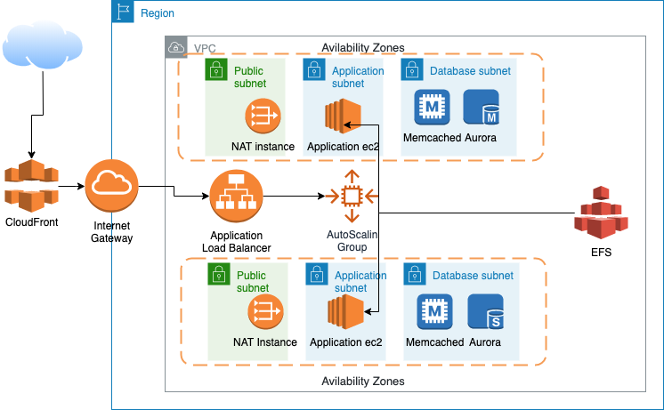

### Endava Devops Challenge
[Task description](./Challenge.md#endava-devops-challenge)
### Description

This Terraform Code will create:
1) A VPC with:
- 4 privete and 2 public subnets.  
The subnets are split as follow:
  - 2 subnets for application servers `10.33.33.0/24, 10.33.34.0/24`
  - 2 subnets for database servers `10.33.35.0/24, 10.33.36.0/24`
  - 2 subnets for public traffic `10.33.32.0/25, 10.33.32.128/25`
- 2 NAT Gateways. One per public subnets

2) Security groups allowing only the certain traffic.
3) AutoScaling group with minimum 2 ec2 instances (one in each AZ)
4) An Application Load Balancer which will scale the AutoScaling group if needed.
The Load Balancer listen on port 443 and will forward the traffic to instances in the AutoScaling group on port 3000 (I assume this will be the application port)
5) EFS mount points which are mounted on every ec2 instances to keep any static content.
6) RDS Aurora cluster with 2 DB instances (One per AZ for Multi-AZ)
7) Elasticahsed (Redis) cluster to keep application sesions.
8) CloudFront to server static and dynamic data.

Every ec2 instance has attached IAM role to allow certain permissions. The IAM role `AmazonEC2RoleforSSM` is also attached, so you can connect to any of the ec2 instances via AWS Console.

Default monitoring is included for every service.

Every service is written as a module.
The base variables which are used for all of the services are in [terraform.tfvars](./terraform.tfvars)
The variables which are specific per service are in files [vpc.tf](./vpc.tf), [app_load_balancer.tf](./app_load_balancer.tf), [app_efs.tf](./app_efs.tf), [security_groups.tf](./security_groups.tf), [app_autoscaling.tf](./app_autoscaling.tf), [app_rds.tf](./app_rds.tf), [app_elasticache.tf](./app_elasticache.tf), [app_cloudfront.tf](./app_cloudfront.tf)

### Topology diagram

### How to use this code.
1) Setup your AWS credentials [Configuring the AWS CLI](https://docs.aws.amazon.com/cli/latest/userguide/cli-chap-configure.html)
2) Setup your [backend.tf](./backend.tf) [Using the S3 remote state](https://www.terraform.io/docs/backends/types/s3.html#using-the-s3-remote-state)
3) Change `aws_profile` and `aws_region` in [terraform.tfvars](terraform.tfvars)
